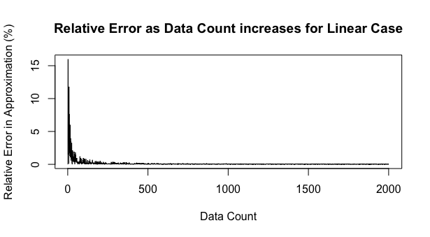

<h1> Approximating Stream-Data with Taylor Series and Akka Streams </h1>

Functions that are infinietly differentiable about a point, $a$, can be approximated using a Taylor Series

```math
f(x) \approx \sum_{n=0}^{\infty} \frac{f^n(a)(x-a)^n}{n!} . 
```

This code uses Akka streams to build a third order approximation of an unknown function $f(x)$ given an input of pairs $(x,f(x))$,

```math
f(x) \approx f(a) + \frac{f^{'}(a)(x-a)}{1!} + \frac{f^{''}(a)(x-a)^2}{2!} + \frac{f^{'''}(a)(x-a)^3}{3!} ,
```

where the value $a$ is taken as the average of the $x$ values, $f(a)$ as the average of the $f(x)$ values, and the derivates of the function at the point $a$ are an average of the average rate of change between sequential data points.\n

The approximation does well so far when the unknown function is linear,



but not so well in the non-linear case,


Two problems with this method is that every average rate of change if worth the same in the approximation of the derivatives and sequential data points may be far apart, where ideally we would calculate the average rate of change over small intervals. It might be possible to weight the effect of each average rate of change such that small-distance rates of change are valued more than larger ones.


